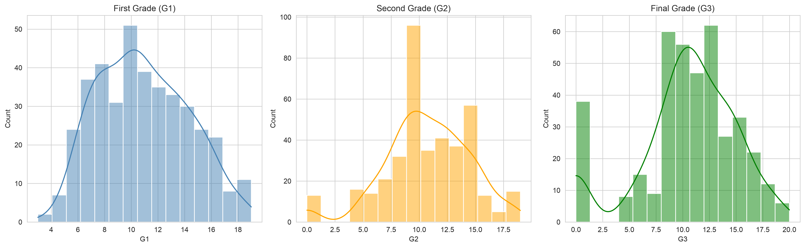
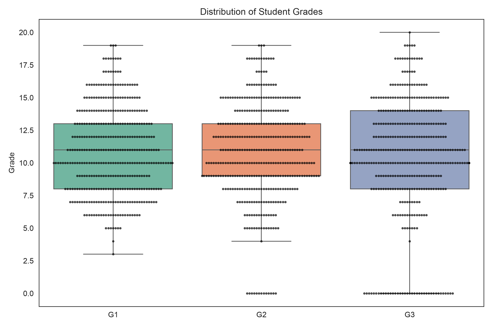
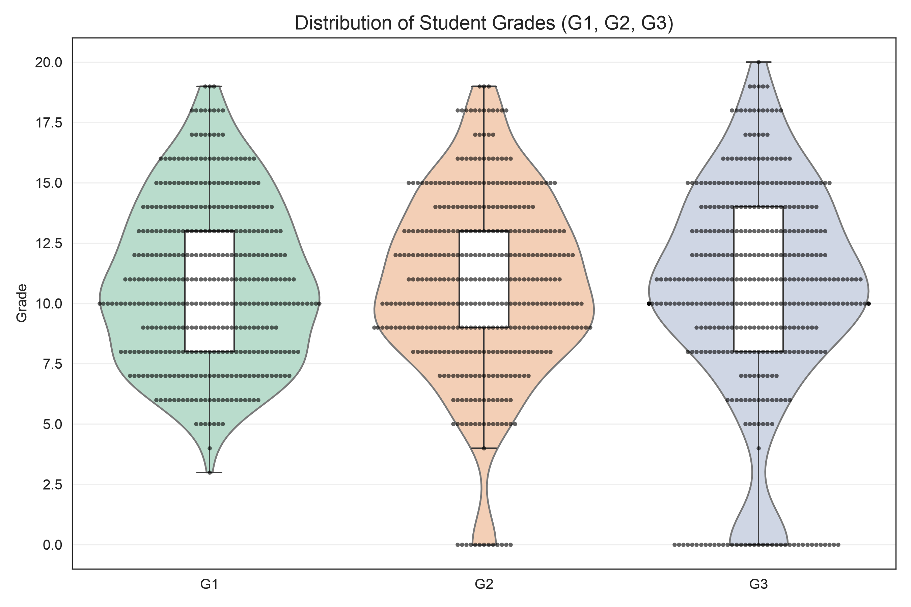
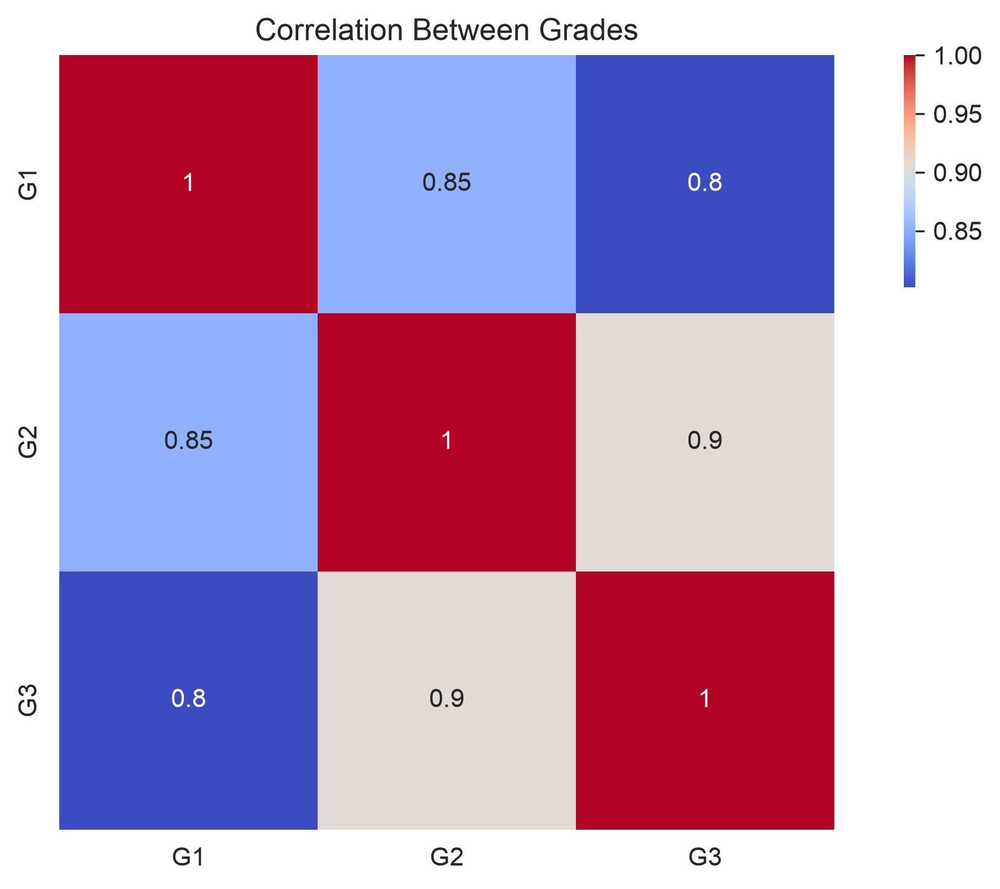
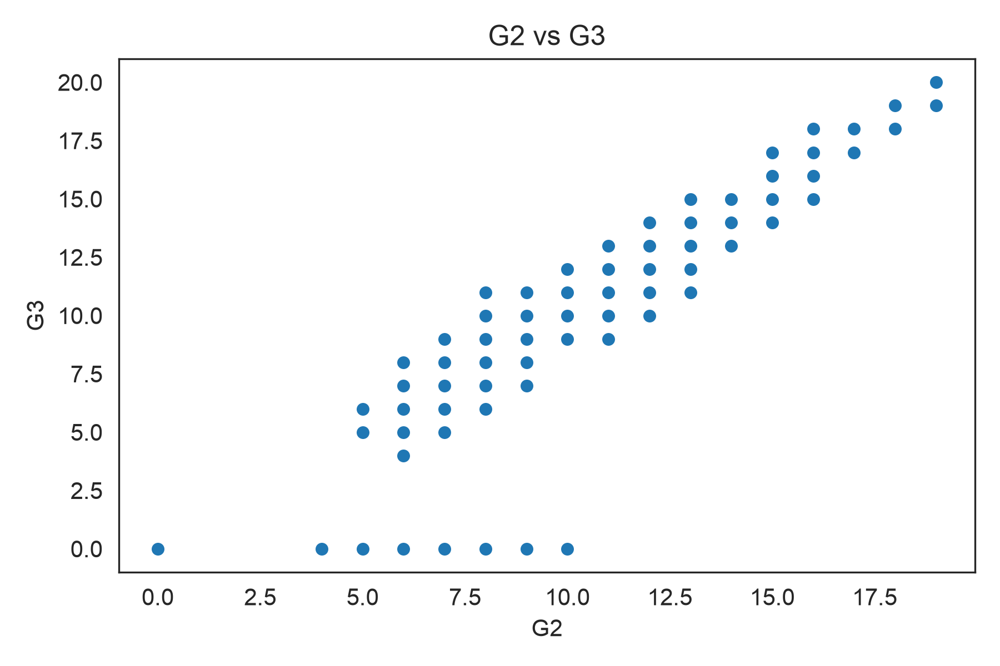
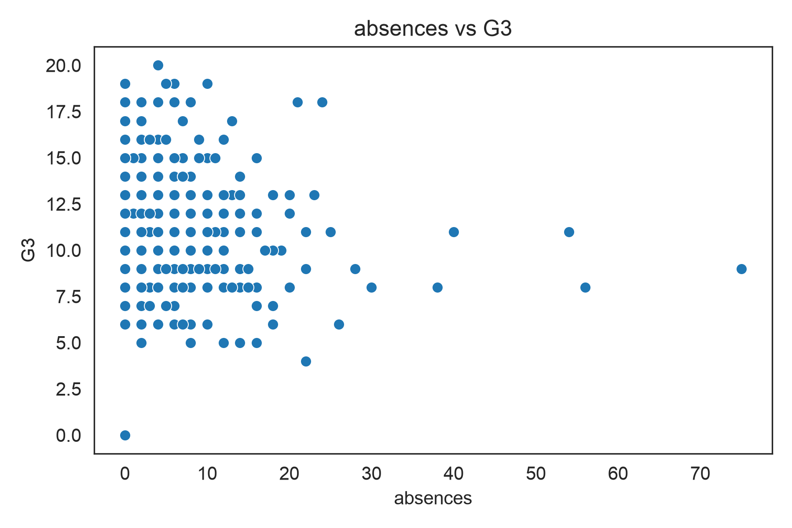
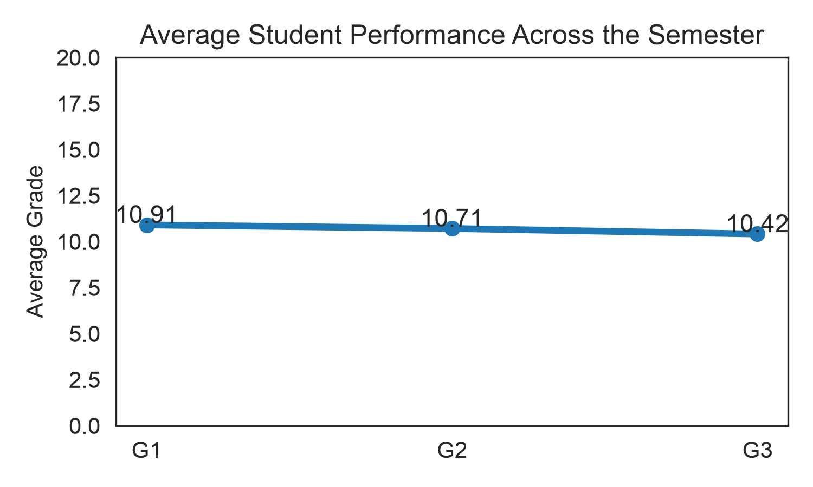
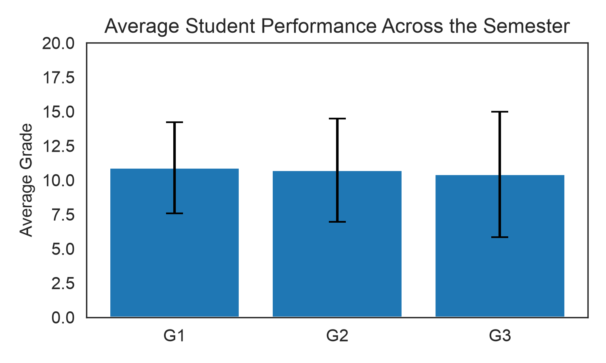

# Predicting Student Final Grades with Machine Learning

---
Here we put together a handful of machine learning models to see how well they can predict a student's final math grade, using the UCI Student Performance dataset. You can grab the data yourself here: https://archive.ics.uci.edu

<p align="center">  </p>

## What this is about

A student's final grade doesn't come out of nowhere — it's shaped by things like how they did earlier in the term, how much they study, how often they show up to class, and whether they've struggled before. This project takes those factors and tries to predict the final math grade (G3) using four different regression models, then compares how well each one actually does.

For it not to just be "train a model, get a number." The notebook walks through the whole process: exploring the data first, cleaning it up, training the models, and then honestly evaluating and interpreting what came out. It's written to be approachable if you're newer to machine learning, but it still follows the habits you'd want in a properly done project — nothing skipped, nothing hand-waved.

---
## How the project flows

```
Student Performance Dataset
             │
             ▼
     Data Exploration
             │
             ▼
 Exploratory Data Analysis
             │
             ▼
   Feature Selection
             │
             ▼
 Train/Test Split
             │
             ▼
 Model Training
   ├── Linear Regression
   ├── Decision Tree
   ├── Random Forest
   └── XGBoost
             │
             ▼
 Performance Evaluation
             │
             ▼
 Model Comparison
             │
             ▼
 Model Interpretation
```

## The data

This comes from the Student Performance Dataset on the UCI Machine Learning Repository.

**What we're trying to predict:** G3, the final math grade.

**What we're predicting it from:**

| Feature   | Description                        |
| --------- | ----------------------------------- |
| G1        | First period grade                  |
| G2        | Second period grade                 |
| studytime | Weekly study time                   |
| failures  | Number of previous class failures   |
| absences  | Number of school absences           |

These felt like the obvious candidates, the kind of things you'd expect to genuinely move the needle on a student's final result, rather than variables that just happen to correlate.

---
## Getting to know the data first

Before training anything, it's worth spending real time understanding what we're working with — how it's shaped, what patterns show up, how variables relate to each other. So the notebook opens with a proper look around:

* descriptive statistics
* histograms
* violin plots
* boxplots
* a correlation matrix
* pairplots
* scatterplots
* how grades progress over the term
* combined violin-box-swarm plots, for a fuller picture of each distribution

<p align="center">  </p>
<p align="center">  </p>
<p align="center">  </p>

---
## How the grades relate to each other

A correlation heatmap shows how the three grades; G1, G2 and G3, move together. It's a quick way to answer a pretty important question: do the earlier assessments actually tell you much about how a student will finish?

<p align="center">  </p>

---
## Scatterplots and pairplots

To dig a bit deeper, we can plot G3 against each of the main predictors; G1, G2, study time, failures, and absences, to get a feel for the shape of those relationships. Pairplots pull everything together into one view, so we can see how all the variables relate at once.

<p align="center">  </p>
<p align="center">  </p>

---
## How performance changes over the term

Here we can look at average performance across the three checkpoints; G1, G2 and G3, to see whether students tend to improve, slip, or stay pretty consistent as the term goes on.

<p align="center">  </p>
<p align="center">  </p>

---
## The models

Four regression models get trained and compared, each one a step up in complexity from the last:

| Model | What it is |
| --- | --- |
| Linear Regression | The simple baseline everything else gets measured against |
| Decision Tree Regression | Splits the data recursively to capture non-linear patterns |
| Random Forest Regression | An ensemble of many decision trees working together |
| XGBoost Regression | A gradient-boosted ensemble, usually the strongest of the bunch |

All four are trained and tested on exactly the same data split, so the comparison between them is fair.

---
## How well did they do?

Each model is scored on R², Mean Absolute Error, Mean Squared Error, and Root Mean Squared Error. We wrap up with all four models placed side by side, so it's easy to see at a glance which one actually earns its keep.

<p align="center">  </p>

---
## What matters most for the prediction

Using Random Forest's built-in feature importance, we show which variables are actually doing the heavy lifting when it comes to predicting a student's final grade, a simple, honest way to look inside the model rather than treating it as a black box.

<p align="center">  </p>

---
## Checking the residuals

Good scores alone don't tell the whole story, so we also look  at the residuals; the gap between predicted and actual grades, for all four models. A model that's doing its job should leave residuals that are scattered randomly, centered around zero, with no obvious pattern and roughly consistent spread. This step often catches problems a plain accuracy number would miss.

<p align="center">  </p>

---
## Predicted vs. actual grades

Finally, we line up each model's predictions against the real final grades, side by side. It's a simple visual gut-check for how close each model actually gets.

<p align="center">  </p>

---
## Repository structure

```
ML_Python/
│
├── data/
│     └── student-mat.csv
│
├── figures/
│     ├── Comparison of Regression Models for Predicting Student Final Grade.png
│     ├── Correlation Matrix.png
│     ├── Residual Plot Comparison of Models.png
│     ├── Top 10 Important Features.png
│     ├── Violin Box Swarm.png
│     └── feature vs Predicted Final Grade.png
│
├── Predicting_student_final_grade_ML.ipynb
├── README_Student.md
└── requirements.txt
```

---
## What you'll need

* numpy
* pandas
* matplotlib
* seaborn
* scikit-learn
* xgboost

---
## What this project covers

Working through this notebook touches on a good spread of the machine learning basics:

* exploratory data analysis
* data visualization
* feature engineering
* train/test splitting
* linear regression
* decision tree regression
* random forest regression
* XGBoost regression
* model evaluation
* residual analysis
* feature importance interpretation
* comparing models against each other
* predictive analytics in Python
