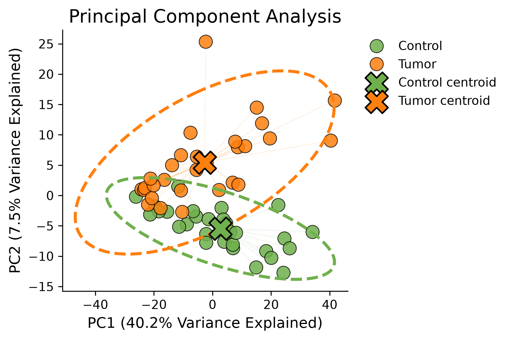
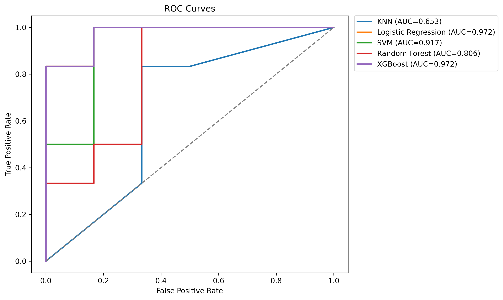
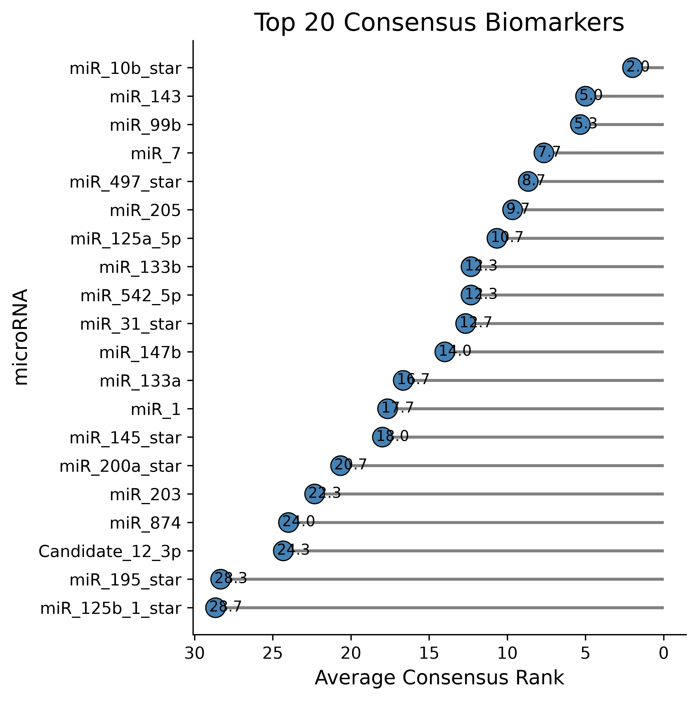

# Can microRNA tell tumor tissue from healthy tissue?

---
A small side project where I trained a handful of classic ML models on microRNA expression data to see how well they can separate cervical tumor tissue from healthy control tissue, and, just as importantly, whether the result actually holds up once you test it properly.

<p align="center">  </p>

## Why I built this

The dataset is tiny by machine-learning standards, 58 tissue samples, a few thousand microRNAs , which is exactly the kind of setting where it's easy to fool yourself. A model can look great and still be wrong for boring reasons: a bit of data leakage here, an unchecked assumption there, no real check on whether "Model A beats Model B" is actually statistically meaningful or just noise from one lucky split.

So here is less about squeezing out the highest accuracy and more about doing the whole pipeline properly: careful preprocessing, nested cross-validation instead of a single train/test split, and formal significance testing before claiming any model is "better."

---
## What's actually happening in the notebook

1. Explore the expression data and narrow it down to the top 20 most variable microRNAs (on log-transformed values, to avoid just picking the highest-expressed ones by default).

2. Reduce dimensionality with PCA to see whether tumor and control tissue separate at all before any modeling happens.

3. Train and tune four classifiers — KNN, Logistic Regression, SVM, and Random Forest — each with nested cross-validation (an inner loop tunes hyperparameters, an outer loop honestly estimates performance).

4. Compare the models with paired statistical tests (Wilcoxon signed-rank, McNemar's, DeLong's test on the AUCs) rather than just eyeballing the numbers, with a multiple-comparisons correction applied on top.

5. Rank candidate biomarkers using a consensus of Random Forest importance, permutation importance, and (where available) SHAP values, instead of trusting any single method alone.

<p align="center">  </p>

---
## Results

Logistic Regression came out on top, with a mean ROC AUC of about **0.99** across the repeated nested cross-validation folds, followed closely by SVM (~0.97) and Random Forest (~0.95). KNN trailed behind at ~0.90.

The more interesting part is what the statistics say: the Wilcoxon test confirms KNN is significantly worse than both Logistic Regression and Random Forest, even after correcting for multiple comparisons. Logistic Regression and SVM, on the other hand, aren't statistically distinguishable from each other — they're both simply strong, and it would be overselling it to call one definitively "the best."

<p align="center">  </p>

A handful of microRNAs showed up consistently across all three importance methods, which is a much more convincing signal than any one method alone.

<p align="center">  </p>

---
## Techniques this project demonstrates

* Nested cross-validation (inner GridSearchCV + outer RepeatedStratifiedKFold) for an honest, non-overfit performance estimate

* Careful handling of train/test separation to avoid subtle data leakage

* Statistical significance testing between models (Wilcoxon, McNemar, DeLong) with Benjamini-Hochberg FDR correction

* PCA with confidence ellipses and group centroids for a quick visual sanity check before modeling

* Consensus feature ranking across multiple importance methods rather than relying on one

* A pipeline that degrades gracefully — if an optional dependency (like SHAP) isn't available, those cells skip cleanly instead of breaking the notebook

---
## Repository structure

```
ML_Python/
│
├── data/
│     └── cervical.csv
│
├── figures/
│     ├── pca_with_centroids.png
│     ├── roc_curves.png
│     ├── confusion_matrix_Logistic Regression.png
│     └── top20_consensus_lollipop.png
│
├── tables/
│     ├── wilcoxon_results.csv
│     ├── delong_results.csv
│     └── consensus_biomarkers.csv
│
├── Classifying_cervical_cancer_tissue_ML.ipynb
└── README_Cervical.md
```

---
## Required packages

* numpy
* pandas
* matplotlib
* seaborn
* scikit-learn
* scipy
* shap *(optional — the notebook runs fine without it)*
